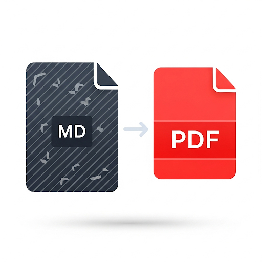

# MitIT Markdown Editor

<div align="center">
  
  
  **A powerful markdown editor with PDF export capabilities**
  
  [](https://opensource.org/licenses/MIT)
  [](https://reactjs.org/)
  [](https://vitejs.dev/)
</div>

## 🚀 Features

- **📝 Real-time Markdown Editing**: Live preview with syntax highlighting
- **📄 PDF Export**: Convert markdown to high-quality PDF documents
- **📁 File Management**: Built-in file explorer for easy document organization
- **🎨 Syntax Highlighting**: Beautiful code syntax highlighting with multiple themes
- **💾 Auto-save**: Automatic saving of your work
- **📱 PWA Support**: Install as a Progressive Web App
- **🌙 Modern UI**: Clean and intuitive user interface
- **⚡ Fast Performance**: Built with Vite for lightning-fast development

## 🛠️ Tech Stack

- **Frontend Framework**: React 18.x
- **Build Tool**: Vite 5.x
- **Styling**: Tailwind CSS
- **State Management**: Zustand
- **Markdown Processing**: Custom markdown parser
- **PDF Generation**: Browser-native PDF export
- **Icons**: Lucide React
- **Development**: TypeScript, ESLint

## 📦 Installation & Setup

### Prerequisites

- Node.js 18+ 
- npm or pnpm

### Clone the Repository

```bash
git clone <repository-url>
cd mitit-markdown-editor
```

### Install Dependencies

```bash
# Using npm
npm install

# Using pnpm
pnpm install
```

### Run Development Server

```bash
# Using npm
npm run dev

# Using pnpm
pnpm dev
```

The application will be available at `http://localhost:5176`

### Build for Production

```bash
# Using npm
npm run build

# Using pnpm
pnpm build
```

## 🎯 Usage

1. **Create/Open Files**: Use the file manager on the left to create new markdown files or open existing ones
2. **Edit Markdown**: Write your markdown content in the editor with real-time preview
3. **Export to PDF**: Click the PDF export button to generate a PDF version of your document
4. **File Management**: Organize your documents using the built-in file explorer
5. **PWA Installation**: Install the app on your device for offline access

## 🐳 Docker Deployment

### Using Docker

```bash
# Build the Docker image
docker build -t mitit-markdown-editor .

# Run the container
docker run -d -p 8037:80 --name mitit-markdown-editor mitit-markdown-editor
```

### Using Docker Compose

```bash
# Start the application
docker-compose up -d

# Stop the application
docker-compose down
```

The application will be available at `http://localhost:8037`

## 📁 Project Structure

```
mitit-markdown-editor/
├── public/                 # Static assets
│   ├── manifest.json      # PWA manifest
│   └── markdown2pdf.png   # App icon
├── src/                   # Source code
│   ├── components/        # React components
│   ├── hooks/            # Custom React hooks
│   ├── pages/            # Page components
│   ├── utils/            # Utility functions
│   ├── App.tsx           # Main App component
│   └── main.tsx          # Application entry point
├── docker/               # Docker configuration
│   └── nginx.conf        # Nginx configuration
├── Dockerfile            # Docker build instructions
├── docker-compose.yml    # Docker Compose configuration
├── package.json          # Dependencies and scripts
├── tailwind.config.js    # Tailwind CSS configuration
├── tsconfig.json         # TypeScript configuration
└── vite.config.ts        # Vite configuration
```

## 🔧 Development

### Available Scripts

- `npm run dev` - Start development server
- `npm run build` - Build for production
- `npm run preview` - Preview production build
- `npm run lint` - Run ESLint
- `npm run check` - Type checking

### Code Standards

- **TypeScript**: Strict type checking enabled
- **ESLint**: Code linting and formatting
- **Tailwind CSS**: Utility-first CSS framework
- **Component Structure**: Small, focused components (<200 lines)
- **File Naming**: PascalCase for components, camelCase for utilities

### Contributing

1. Fork the repository
2. Create a feature branch (`git checkout -b feature/amazing-feature`)
3. Commit your changes (`git commit -m 'Add some amazing feature'`)
4. Push to the branch (`git push origin feature/amazing-feature`)
5. Open a Pull Request

## 📄 License

This project is licensed under the MIT License - see the [LICENSE](LICENSE) file for details.

## 🙏 Acknowledgments

- Built with ❤️ using React and Vite
- Icons provided by [Lucide](https://lucide.dev/)
- Styling powered by [Tailwind CSS](https://tailwindcss.com/)

---

<div align="center">
  Made with ❤️ by MitIT Team
</div>