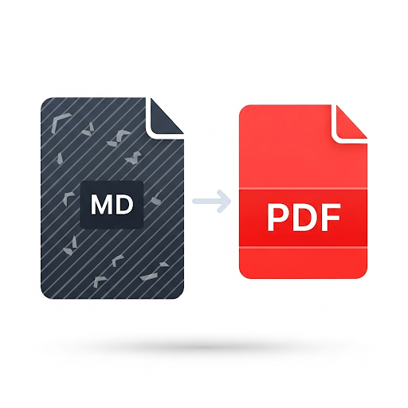

# MitIT Multi-Mode Editor

<div align="center">
  
  
  **A powerful multi-mode editor with Markdown, Mermaid, and PlantUML support**
  
  [](https://opensource.org/licenses/MIT)
  [](https://reactjs.org/)
  [](https://vitejs.dev/)
</div>

## 🚀 Features

### 📝 Multi-Mode Editor
- **Markdown Mode**: Full-featured markdown editing with live preview
- **Mermaid Mode**: Create flowcharts, sequence diagrams, and more
- **PlantUML Mode**: Generate UML diagrams with PlantUML syntax

### 📤 Export Options
- **Markdown Mode**: 
  - 🖨️ Print/PDF export with Thai font support
  - 📄 DOCX export for Microsoft Word compatibility
  - 📊 Excel export for spreadsheet format
- **Mermaid/PlantUML Modes**: 
  - 🖼️ SVG export for high-quality vector graphics

### 🌏 Thai Language Support
- **Thai Fonts**: Proper rendering with Sarabun and Kanit fonts
- **Export Compatibility**: Thai text support in all export formats
- **Print Quality**: High-quality Thai text in PDF exports

### 💾 Document Management
- **Local Storage**: Documents saved using IndexedDB
- **File Operations**: Create, rename, and delete documents
- **File Upload**: Drag & drop markdown file support
- **Auto-save**: Automatic saving of your work

### 🎨 User Experience
- **Real-time Preview**: Live preview for all editing modes
- **Theme Support**: Light and dark theme toggle
- **Responsive Design**: Works seamlessly on desktop and mobile
- **Modern UI**: Clean and intuitive user interface
- **⚡ Fast Performance**: Built with Vite for lightning-fast development

## 🛠️ Tech Stack

- **Frontend Framework**: React 18.x
- **Build Tool**: Vite 5.x
- **Styling**: Tailwind CSS
- **State Management**: Zustand
- **Markdown Processing**: Custom markdown parser
- **Diagram Rendering**: 
  - Mermaid for flowcharts and diagrams
  - PlantUML for UML diagrams
- **Data Storage**: IndexedDB for local document storage
- **Export Capabilities**: 
  - Browser-native PDF/Print export
  - DOCX generation
  - Excel export
  - SVG export for diagrams
- **Font Support**: Thai fonts integration (Sarabun, Kanit)
- **Icons**: Lucide React
- **Development**: TypeScript, ESLint

## 📦 Installation & Setup

### Prerequisites

- Node.js 18+ 
- npm or pnpm

### Clone the Repository

```bash
git clone <repository-url>
cd mitit-markdown-editor
```

### Install Dependencies

```bash
# Using npm
npm install

# Using pnpm
pnpm install
```

### Run Development Server

```bash
# Using npm
npm run dev

# Using pnpm
pnpm dev
```

The application will be available at `http://localhost:5173`

### Build for Production

```bash
# Using npm
npm run build

# Using pnpm
pnpm build
```

## 🎯 Usage

### Getting Started
1. **Create/Open Documents**: Use the document manager to create new files or open existing ones
2. **Choose Your Mode**: Select between Markdown, Mermaid, or PlantUML editing modes
3. **Real-time Editing**: Write your content with live preview in the right panel

### Markdown Mode
- Write markdown content with syntax highlighting
- Export options: Print/PDF, DOCX, Excel
- Full Thai language support in exports

### Mermaid Mode
- Create flowcharts, sequence diagrams, gantt charts, and more
- Export as SVG for high-quality vector graphics
- Real-time diagram preview

### PlantUML Mode
- Generate UML diagrams using PlantUML syntax
- Export as SVG format
- Support for class diagrams, sequence diagrams, and more

### File Management
- **Local Storage**: All documents are saved locally using IndexedDB
- **File Operations**: Create, rename, and delete documents
- **File Upload**: Drag and drop markdown files to import
- **Theme Toggle**: Switch between light and dark themes

## 🐳 Docker Deployment

### Using Docker

```bash
# Build the Docker image
docker build -t mitit-markdown-editor .

# Run the container
docker run -d -p 8037:80 --name mitit-markdown-editor mitit-markdown-editor
```

### Using Docker Compose

```bash
# Start the application
docker-compose up -d

# Stop the application
docker-compose down
```

The application will be available at `http://localhost:8037`

## 📁 Project Structure

```
mitit-multi-mode-editor/
├── public/                 # Static assets
│   ├── manifest.json      # PWA manifest
│   └── markdown2pdf.png   # App icon
├── src/                   # Source code
│   ├── components/        # React components
│   │   ├── OToolbar.tsx   # Main toolbar with mode switching
│   │   ├── MarkdownEditor.tsx # Markdown editing component
│   │   ├── MermaidEditor.tsx  # Mermaid diagram editor
│   │   └── PlantUMLEditor.tsx # PlantUML diagram editor
│   ├── hooks/            # Custom React hooks
│   ├── stores/           # Zustand state management
│   ├── utils/            # Utility functions
│   │   ├── pdfExport.ts  # PDF export utilities
│   │   ├── docxExport.ts # DOCX export utilities
│   │   └── excelExport.ts # Excel export utilities
│   ├── App.tsx           # Main App component
│   └── main.tsx          # Application entry point
├── docker/               # Docker configuration
│   └── nginx.conf        # Nginx configuration
├── Dockerfile            # Docker build instructions
├── docker-compose.yml    # Docker Compose configuration
├── package.json          # Dependencies and scripts
├── tailwind.config.js    # Tailwind CSS configuration
├── tsconfig.json         # TypeScript configuration
└── vite.config.ts        # Vite configuration
```

## 🔧 Development

### Available Scripts

- `npm run dev` - Start development server
- `npm run build` - Build for production
- `npm run preview` - Preview production build
- `npm run lint` - Run ESLint
- `npm run check` - Type checking

### Code Standards

- **TypeScript**: Strict type checking enabled
- **ESLint**: Code linting and formatting
- **Tailwind CSS**: Utility-first CSS framework
- **Component Structure**: Small, focused components (<200 lines)
- **File Naming**: PascalCase for components, camelCase for utilities

### Contributing

1. Fork the repository
2. Create a feature branch (`git checkout -b feature/amazing-feature`)
3. Commit your changes (`git commit -m 'Add some amazing feature'`)
4. Push to the branch (`git push origin feature/amazing-feature`)
5. Open a Pull Request

## 📄 License

This project is licensed under the MIT License - see the [LICENSE](LICENSE) file for details.

## 🙏 Acknowledgments

- Built with ❤️ using React and Vite
- Icons provided by [Lucide](https://lucide.dev/)
- Styling powered by [Tailwind CSS](https://tailwindcss.com/)

---

<div align="center">
  Made with ❤️ by MitIT Team
</div>