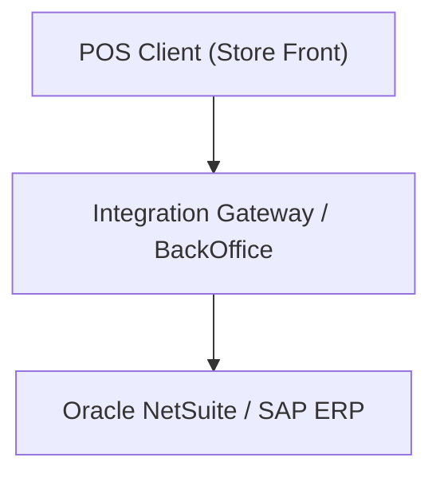
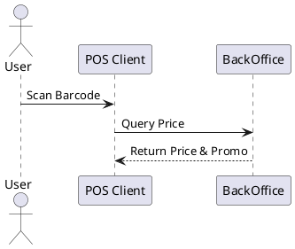

# MitIT Markdown Editor

<div align="center">
  

  ### **Advanced Markdown, Mermaid & PlantUML Editor with Official Adasoft Template Export**

  [](https://opensource.org/licenses/MIT)
  [](https://reactjs.org/)
  [](https://vitejs.dev/)
  [](https://www.typescriptlang.org/)
  [](https://web.dev/progressive-web-apps/)
</div>

---

**MitIT Markdown Editor** is a modern, high-performance editor with real-time live preview for **Markdown**, **Mermaid**, and **PlantUML**. It features offline-first project management and produces publication-ready **PDF & DOCX** documents formatted with the official **Adasoft Company Template** (`public/adasoft-template.docx`).

---

## 🌟 Key Features

### 1. 📊 Interactive Mermaid & PlantUML Live Diagram Preview
- **Auto-Render in Markdown**: Write or paste ```` ```mermaid ```` or ```` ```plantuml ```` blocks inside Markdown — they are automatically converted into interactive visual diagrams (SVG) in the live preview.
- **Source Code Included Below Diagram**: Every diagram card displays the rendered graphic on top with its formatted source code underneath.
- **Code Actions**: 1-click **"คัดลอกโค้ด (Copy Code)"** and **"ซ่อน/แสดงโค้ด (Toggle Code)"** for clutter-free reading.
- **🔍 Fullscreen Zoom Modal**: Inspect intricate flowcharts, sequence diagrams, and multi-tier architectures in full resolution with the built-in lightbox viewer.
- **Theme-Aware**: Seamlessly switches diagram styling between Light Mode and Dark Mode.

### 2. 📑 Official Adasoft Template PDF & DOCX Export
- **Authentic Header**: Adasoft *"Grow Together"* logo, full corporate address, telephone, fax, and contact email (`info@ada-soft.com`).
- **Official Certification Footer**: High-resolution certification badges strip (**TÜV NORD ISO 9001**, **ISO 45001**, **Otabu ISO 27001:2022**, **ISO/IEC 29110 SGS**, and **CMMI Level 3**) with page numbering.
- **Smart Pagination Engine**: Eliminates clipped text lines across page breaks with intelligent paragraph splitting and table row pagination.
- **Diagrams in Export**: Mermaid and PlantUML diagrams are automatically scaled and embedded into exported PDFs and Word DOCX files.

### 3. 📋 1-Click Copy to MS Word & Email (Rich Text)
- Click **"คัดลอกไป Word/Email"** in the preview toolbar to copy rich formatted HTML directly to your clipboard.
- Paste directly into Microsoft Word, Outlook, or Gmail with rendered diagram graphics, tables, and typography intact.

### 4. 🗂️ Project & Document Organization
- **Color-Coded Projects**: Organize documents by project folders with custom color tags.
- **Offline-First Storage**: Powered by IndexedDB (Dexie) with automatic debounced saving.
- **Quick Search & Replace**: `Ctrl+F` for search, `Ctrl+H` for find & replace with case sensitivity support.
- **Batch Import/Export**: Import `.md` files or export multiple documents into Excel spreadsheets.

### 5. 🇹🇭 Enhanced Thai Typography Support
- Native integration with **TH Sarabun New**, **Sarabun**, **Kanit**, and **Prompt** Google Fonts.
- Crisp line-height and word-wrapping optimized for Thai business and technical documents.

---

## 🛠️ Modes & Supported Syntaxes

| Mode | Description |
|------|-------------|
| **Markdown** | GFM Markdown with live table formatting, task lists, code highlighting, and auto-rendered Mermaid / PlantUML blocks |
| **Mermaid** | Dedicated diagram editor for Flowcharts, Sequence Diagrams, Class Diagrams, State Diagrams, Gantt Charts, Git Graphs, etc. |
| **PlantUML** | Dedicated UML editor with live SVG rendering via public & Kroki encoders with custom theme support |

### Diagram Block Syntax in Markdown

````markdown
### 3-Tier High-Level Architecture


```mermaid
flowchart TD
    Client["POS Client (Store Front)"] --> Gateway["Integration Gateway / BackOffice"]
    Gateway --> ERP["Oracle NetSuite / SAP ERP"]
```


```plantuml
@startuml
actor User
participant "POS Client" as POS
participant "BackOffice" as BO

User -> POS: Scan Barcode
POS -> BO: Query Price
BO --> POS: Return Price & Promo
@enduml
```
````

---

## 📤 Export Options

| Format | Output Description | Template Used |
|--------|---------------------|---------------|
| **PDF** | High-resolution PDF with Smart Pagination & Thai fonts | Adasoft Official Template / Modern Theme |
| **DOCX** | Native `.docx` document with Word `altChunk` HTML engine | `public/adasoft-template.docx` |
| **Markdown** | Standard `.md` text file | — |
| **Excel** | Multi-document metadata and content workbook | — |
| **SVG** | Vector diagram download (Mermaid / PlantUML modes) | — |

---

## 💻 Tech Stack

- **Frontend**: React 18, TypeScript, Tailwind CSS, Zustand, Lucide Icons
- **Markdown & Diagrams**: marked (GFM), Mermaid.js v10, PlantUML Encoder
- **Document Generation**: jsPDF, html2canvas, PizZip, html-docx-js-typescript, XLSX
- **Build & PWA**: Vite 6, vite-plugin-pwa (Workbox caching)
- **Database**: Dexie.js (IndexedDB)

---

## 🚀 Getting Started

### Prerequisites
- **Node.js 18+** and **npm** (or **pnpm**)

### Installation

```bash
# Clone the repository
git clone https://github.com/ITeeMit/MitIT-Markdown-Editor.git
cd MitIT-Markdown-Editor

# Install dependencies
npm install

# Start the development server
npm run dev
```

Open your browser at **http://localhost:5173**

### Production Build

```bash
# Build the production PWA bundle
npm run build

# Preview production build locally
npm run preview
```

---

## 📁 Project Structure

```
├── public/
│   ├── adasoft-template.docx       # Official Word template
│   ├── adasoft-header-logo.png     # Header Logo ("Grow Together")
│   └── adasoft-footer-badges.png   # Footer Certifications (ISO/CMMI/SGS)
├── src/
│   ├── components/
│   │   ├── OMarkdownEditor.tsx     # Code & Markdown editor pane
│   │   ├── OPreviewPanel.tsx       # Live Preview with interactive diagram cards & zoom
│   │   ├── OToolbar.tsx            # Action toolbar & export buttons
│   │   ├── OFileManager.tsx        # Project & file hierarchy manager
│   │   └── PdfExportModal.tsx      # Export configuration dialog
│   ├── stores/
│   │   ├── editorStore.ts          # Document & active mode state
│   │   └── projectStore.ts         # Project folders state
│   └── utils/
│       ├── adaExportPipeline.ts    # AltChunk Word template pipeline & syntax fixers
│       ├── pdfEngine.ts            # Dynamic Page-by-Page Smart Pagination PDF Engine
│       └── exportUtils.ts          # Unified ExportService
├── server/
│   └── adaPdfExport.ts             # Server-side Word COM / Python PDF converter (optional)
├── vite.config.ts                  # Vite & PWA configuration
└── package.json
```

---

## 🐳 Docker Deployment

Run with Docker:
```bash
docker build -t mitit-markdown-editor .
docker run -d -p 8037:80 --name mitit-markdown-editor mitit-markdown-editor
```
Or with `docker-compose`:
```bash
docker-compose up -d
```
Access the application at **http://localhost:8037**

---

## 📄 License

This project is licensed under the MIT License — see the [LICENSE](LICENSE) file for details.

---

<div align="center">
  Developed with ❤️ by <strong>MitIT Team</strong> · Adasoft Template Integration
</div>
