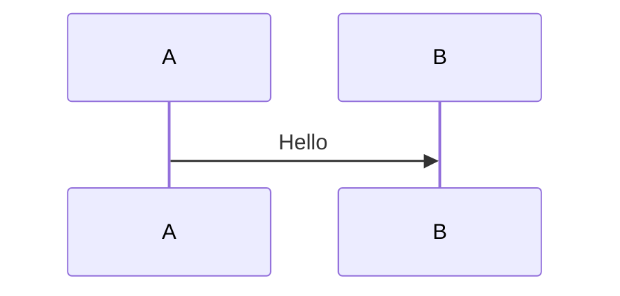
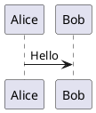

# MitIT Markdown Editor

<div align="center">
  

  **Multi-mode editor with Adasoft-branded DOCX/PDF export**

  [](https://opensource.org/licenses/MIT)
  [](https://reactjs.org/)
  [](https://vitejs.dev/)
</div>

Markdown, Mermaid, and PlantUML editor with live preview, project organization, and professional export using the **Adasoft Word template** (`public/adasoft-template.docx`).

## Features

### Multi-mode editing

| Mode | Description |
|------|-------------|
| **Markdown** | GFM markdown with live preview |
| **Mermaid** | Flowcharts, sequence diagrams, Gantt charts |
| **PlantUML** | UML diagrams via Kroki |

**Editor shortcuts:** `Ctrl+F` find · `Ctrl+H` find & replace · case-sensitive search

### Project organization

- Sidebar projects with colors, drag-and-drop, and nested documents
- IndexedDB storage (offline-first)
- Import `.md` files · auto-save · rename / delete

### Export

| Format | Markdown mode | Diagram modes |
|--------|---------------|---------------|
| **PDF** | Adasoft template (primary) | — |
| **DOCX** | Adasoft template | — |
| **Markdown** | `.md` download | — |
| **Excel** | Multi-document workbook | — |
| **SVG** | — | Mermaid / PlantUML |

#### Adasoft DOCX / PDF pipeline

Exports use `src/utils/adaExportPipeline.ts` and `public/adasoft-template.docx`:

1. Markdown → HTML (headings, tables, code blocks, diagrams)
2. **Mermaid / PlantUML** → PNG via [mermaid.ink](https://mermaid.ink) / [Kroki](https://kroki.io), placed **above** the source code in a gray box
3. HTML injected into the template via Word **altChunk**
4. Template header rebuilt (logo + contact, 2 lines) and heading sizes patched (H3 = 12pt baseline)

**PDF conversion order:**

1. Browser builds template DOCX → `POST /api/export/pdf-from-docx` → Word COM (flatten altChunk, then PDF)
2. Fallback: `POST /api/export/pdf` → Python `md_to_pdf.py` (MD → DOCX → PDF)
3. Fallback: browser html2canvas + jsPDF with template shell

**DOCX:** data-URI diagram images (Word displays them correctly in altChunk HTML).

**PDF:** same data-URI HTML; server flattens altChunk to native Word content before PDF export.

### Thai language support

- TH Sarabun New / Sarabun in exports
- Thai text in PDF, DOCX, and print output

## Tech stack

- **UI:** React 18, Tailwind CSS, Zustand, Lucide
- **Build:** Vite 6, TypeScript
- **Markdown:** marked (GFM)
- **Diagrams:** Mermaid, PlantUML encoder + external render APIs
- **Export:** PizZip, html-docx-js-typescript, html2canvas, jsPDF
- **Storage:** Dexie (IndexedDB)
- **PWA:** vite-plugin-pwa

## Prerequisites

- **Node.js 18+**
- **PDF export (recommended, Windows):**
  - Microsoft Word (for COM automation)
  - Python 3 with `pywin32`, `python-docx`, `requests`, `beautifulsoup4`, `markdown`
  - `md_to_pdf.py` at `../../.agent/scripts/md_to_pdf.py` relative to this project (or adjust path in `server/adaPdfExport.ts`)

Without Word/Python, PDF falls back to browser rendering (layout may differ).

## Installation

```bash
git clone https://github.com/ITeeMit/MitIT-Markdown-Editor.git
cd MitIT-Markdown-Editor
npm install
npm run dev
```

Open **http://localhost:5173**

### Production build

```bash
npm run build
npm run preview
```

## Usage

1. Create or open a document from the sidebar.
2. Choose **Markdown**, **Mermaid**, or **PlantUML** mode.
3. Edit with live preview.
4. Export from the toolbar: **PDF**, **DOCX**, **MD**, **Excel**, or **SVG** (diagram modes).

### Diagram blocks in Markdown

````markdown

```mermaid
sequenceDiagram
    A->>B: Hello
```


```plantuml
@startuml
Alice -> Bob: Hello
@enduml
```
````

Each block exports as **diagram image + source code** (same order as DOCX).

## Development

| Script | Description |
|--------|-------------|
| `npm run dev` | Dev server + PDF export API middleware |
| `npm run build` | Production build |
| `npm run check` | TypeScript check |
| `npm run lint` | ESLint |

### Verify export pipeline

```bash
node scripts/verify-heading-patch.mjs
node scripts/verify-header-rebuild.mjs
node scripts/verify-diagram-embed.mjs
npm run check
```

### Key paths

```
├── public/
│   └── adasoft-template.docx    # Word template (required for DOCX/PDF)
├── plugins/
│   └── adaPdfExportPlugin.ts    # Vite middleware: /api/export/pdf*
├── server/
│   └── adaPdfExport.ts          # Word COM / Python PDF conversion
├── scripts/                     # Template & export verification
├── src/utils/
│   ├── adaExportPipeline.ts     # Core MD → HTML → DOCX/PDF
│   └── exportUtils.ts           # ExportService API
└── docs/test/                   # Export test notes
```

### API (dev server only)

| Endpoint | Method | Body | Description |
|----------|--------|------|-------------|
| `/api/export/pdf-from-docx` | POST | DOCX binary | Template DOCX → PDF |
| `/api/export/pdf` | POST | JSON `{ content, title }` | Markdown → PDF (Python) |

## Docker

```bash
docker build -t mitit-markdown-editor .
docker run -d -p 8037:80 --name mitit-markdown-editor mitit-markdown-editor
```

Or: `docker-compose up -d` → **http://localhost:8037**

> Docker serves the static PWA only. Server-side PDF (Word COM) requires the Windows dev setup above.

## License

MIT — see [LICENSE](LICENSE).

---

<div align="center">
  Made with ❤️ by MitIT Team · Adasoft template export
</div>
