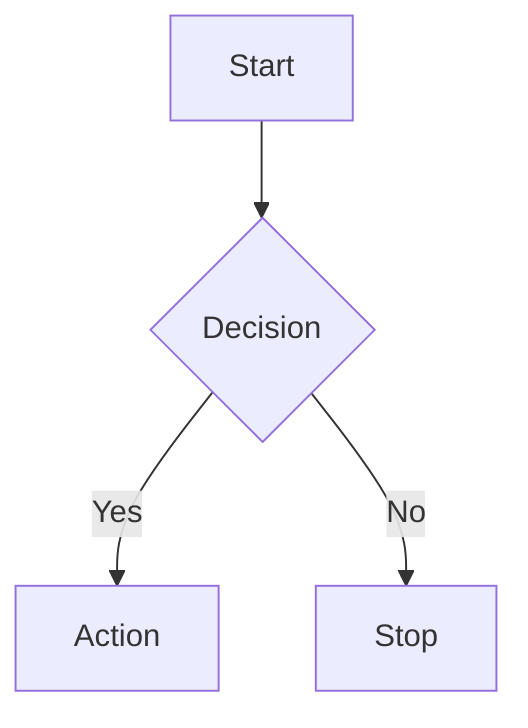
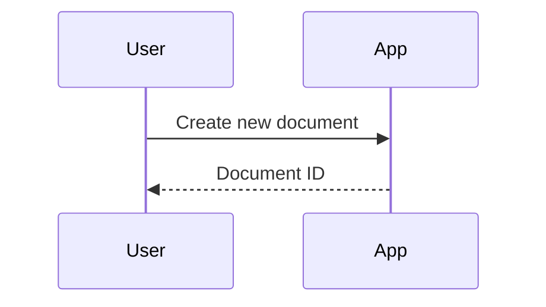

# ชุดกรณีทดสอบ (Test Cases) — Multi‑Mode Markdown Editor

เอกสารนี้รวบรวมกรณีทดสอบการใช้งานหลักของระบบใน 3 โหมด: `markdown`, `mermaid`, `plantuml` เพื่อยืนยันการทำงานฟังก์ชันสร้างไฟล์, เปลี่ยนชื่อ, แสดงตัวอย่าง, การส่งออก, การอัปโหลดไฟล์ และคีย์ลัดบนคีย์บอร์ด

## เงื่อนไขก่อนทดสอบ
- เปิดแอปในเบราว์เซอร์ (เช่น `http://localhost:5173`) และให้สิทธิ์ `localStorage`
- ระบบ build สำเร็จ และหน้าแอปโหลดได้ตามปกติ
- เปิดใช้งานแถบเครื่องมือ (Toolbar) และพาเนล Preview ได้

## ข้อมูลทดสอบ
- ตัวอย่าง Markdown (`sample.md`):

```markdown
# หัวเรื่องทดสอบ

ข้อความปกติ พร้อม **ตัวหนา**, *ตัวเอียง*, และ __ขีดเส้นใต้__

- รายการ 1
- รายการ 2


```

- ตัวอย่าง Mermaid (`diagram.mmd`):



- ตัวอย่าง PlantUML (`diagram.puml`):


---

## 1) โหมด Markdown

### TC‑MD‑01: สร้างเอกสารใหม่ (Create)
- ขั้นตอน:
  - คลิก "New Document"
  - ตรวจสอบว่า `mode` เป็น `markdown`
- ผลที่คาดหวัง:
  - สร้างเอกสารใหม่สำเร็จ มีค่า `title`, `content`, `createdAt`, `updatedAt`, `tags`, `mode`
  - ค่า `content` เริ่มต้นถูกใส่ตามเทมเพลต

### TC‑MD‑02: เปลี่ยนชื่อเอกสาร (Rename)
- ขั้นตอน:
  - คลิกแก้ไขชื่อในแถบชื่อเอกสาร หรือเมนู Rename
  - ป้อนชื่อใหม่และยืนยัน
- ผลที่คาดหวัง:
  - ชื่อเอกสารเปลี่ยนตามค่าที่ตั้ง และแสดงในรายการไฟล์

### TC‑MD‑03: แสดงตัวอย่าง (Preview)
- ขั้นตอน:
  - เปิดพาเนล Preview หรือโหมด Split
  - พิมพ์ข้อความพร้อมรูปแบบ **Bold**, *Italic*, __Underline__
- ผลที่คาดหวัง:
  - พรีวิวแสดงผลรูปแบบตัวอักษรถูกต้อง

### TC‑MD‑04: ส่งออก (Export) PDF/DOCX/XLSX
- ขั้นตอน:
  - เปิดเมนู Export
  - เลือก `PDF` และดาวน์โหลดไฟล์
  - เลือก `DOCX` และดาวน์โหลดไฟล์
  - เลือก `XLSX` และดาวน์โหลดไฟล์
- ผลที่คาดหวัง:
  - ได้ไฟล์ `.pdf`, `.docx`, `.xlsx` ครบถ้วน
  - ชื่อไฟล์อ้างอิงจาก `title`
  - PDF/DOCX แสดงข้อความไทยถูกต้อง, XLSX มีคอลัมน์ `title, content, createdAt, updatedAt, tags, mode`

### TC‑MD‑05: อัปโหลดไฟล์ Markdown (Upload)
- ขั้นตอน:
  - ไปยังเมนู Import/Restore หรือฟังก์ชัน Upload
  - เลือกไฟล์ `sample.md`
- ผลที่คาดหวัง:
  - เนื้อหาโหลดเข้าสู่เอกสารได้ และ `mode` ยังคงเป็น `markdown`

### TC‑MD‑06: คีย์ลัด (Shortcuts)
- ขั้นตอน:
  - กด `Ctrl+B` เพื่อทำตัวหนา
  - กด `Ctrl+I` เพื่อทำตัวเอียง
  - กด `Ctrl+U` เพื่อขีดเส้นใต้
  - กด `Ctrl+S` เพื่อบันทึก
- ผลที่คาดหวัง:
  - เนื้อหาถูกปรับรูปแบบตามคีย์ลัด และระบบบันทึกสำเร็จ (เวลา `updatedAt` เปลี่ยน)

---

## 2) โหมด Mermaid

### TC‑MM‑01: สร้างเอกสารใหม่
- ขั้นตอน:
  - คลิก "New Document" และสลับ `mode` เป็น `mermaid`
  - ใส่โค้ด mermaid จากตัวอย่าง `diagram.mmd`
- ผลที่คาดหวัง:
  - เอกสารถูกสร้างด้วย `mode=mermaid` และพรีวิวแผนภาพเรนเดอร์ได้

### TC‑MM‑02: เปลี่ยนชื่อเอกสาร
- ขั้นตอน:
  - แก้ไขชื่อ และยืนยัน
- ผลที่คาดหวัง:
  - ชื่อปรับเปลี่ยนและแสดงในรายการ

### TC‑MM‑03: แสดงตัวอย่าง
- ขั้นตอน:
  - เปิดพาเนล Preview
- ผลที่คาดหวัง:
  - แผนภาพ mermaid แสดงผลตามโค้ดล่าสุด

### TC‑MM‑04: ส่งออก SVG
- ขั้นตอน:
  - ใช้คำสั่ง "Export Diagram as SVG"
- ผลที่คาดหวัง:
  - ได้ไฟล์ `.svg` 1 ไฟล์ ชื่อไฟล์อ้างอิงจาก `title`

### TC‑MM‑05: อัปโหลดไฟล์ Mermaid
- ขั้นตอน:
  - ใช้ Import/Upload เลือกไฟล์ `diagram.mmd`
- ผลที่คาดหวัง:
  - เนื้อหาโหลดได้ถูกต้อง และ `mode` เป็น `mermaid`

---

## 3) โหมด PlantUML

### TC‑PU‑01: สร้างเอกสารใหม่
- ขั้นตอน:
  - คลิก "New Document" และสลับ `mode` เป็น `plantuml`
  - ใส่โค้ด PlantUML จากตัวอย่าง `diagram.puml`
- ผลที่คาดหวัง:
  - เอกสารถูกสร้างด้วย `mode=plantuml` และพรีวิวแผนภาพเรนเดอร์ได้

### TC‑PU‑02: เปลี่ยนชื่อเอกสาร
- ขั้นตอน:
  - แก้ไขชื่อ และยืนยัน
- ผลที่คาดหวัง:
  - ชื่อปรับเปลี่ยนและแสดงในรายการ

### TC‑PU‑03: แสดงตัวอย่าง
- ขั้นตอน:
  - เปิดพาเนล Preview
- ผลที่คาดหวัง:
  - แผนภาพ PlantUML แสดงผลตามโค้ดล่าสุด

### TC‑PU‑04: ส่งออก SVG
- ขั้นตอน:
  - ใช้คำสั่ง "Export Diagram as SVG"
- ผลที่คาดหวัง:
  - ได้ไฟล์ `.svg` 1 ไฟล์ ชื่อไฟล์อ้างอิงจาก `title`

### TC‑PU‑05: อัปโหลดไฟล์ PlantUML
- ขั้นตอน:
  - ใช้ Import/Upload เลือกไฟล์ `diagram.puml`
- ผลที่คาดหวัง:
  - เนื้อหาโหลดได้ถูกต้อง และ `mode` เป็น `plantuml`

---

## เกณฑ์ผ่าน/ไม่ผ่าน (Pass/Fail Criteria)
- ทุกรายการสร้าง/เปลี่ยนชื่อ/พรีวิว/ส่งออก/อัปโหลด ทำงานตามผลที่คาดหวัง
- ไฟล์ที่ส่งออกเปิดได้โดยไม่มี error และเนื้อหาถูกต้อง
- คีย์ลัดปรับรูปแบบข้อความได้ และระบบบันทึก (`Ctrl+S`) อัปเดตเวลา `updatedAt`

## หมายเหตุ
- หากพบไฟล์สำรอง/นำเข้าแบบ legacy ให้ตรวจสอบว่าระบบแปลงเป็นโครงสร้างใหม่ (title/content/tags/mode/createdAt/updatedAt) ได้ครบก่อนใช้งาน

---

## 4) เมนูเครื่องมือ (Tools)

### TC‑TO‑01: เปิดเมนูเครื่องมือและแดชบอร์ด (Dashboard)
- ขั้นตอน:
  - คลิกไอคอน "Database" บน Toolbar เพื่อเปิด "เครื่องมือจัดการฐานข้อมูล"
  - อยู่แท็บ "แดชบอร์ด" ตรวจสอบการแสดงผลตัวชี้วัด: จำนวนเอกสาร, ขนาดข้อมูล, วันที่เอกสารเก่าสุด/ใหม่สุด
- ผลที่คาดหวัง:
  - แสดงค่า `totalDocuments`, `totalSize` ด้วยรูปแบบที่ถูกต้อง (KB/MB)
  - วันที่แสดงผลในรูปแบบไทย `th-TH`; กรณีไม่มีข้อมูลแสดง "ไม่มีข้อมูล"
- ผลทดสอบ: ผ่าน — ค่าทั้งหมดแสดงถูกต้องตามเอกสารที่มีอยู่และไม่พบ error

### TC‑TO‑02: ล้างข้อมูล (Purge) — ตัวกรองและการลบ
- ขั้นตอน:
  - เปิดแท็บ "ล้างข้อมูล"
  - ใช้ตัวกรอง `mode=markdown/mermaid/plantuml`, ตั้งช่วงวันที่ด้วย quick filter (เช่น 3/6/12 เดือน), ใส่คำค้นหาชื่อเอกสาร
  - คลิก "เลือกทั้งหมด", แล้วคลิก "ลบเอกสารที่เลือก" และยืนยันในกล่องยืนยัน
- ผลที่คาดหวัง:
  - รายการที่ตรงเงื่อนไขถูกเลือกครบ, จำนวนที่เลือกตรงตามที่แสดง
  - หลังยืนยัน รายการที่ถูกลบหายไป, ข้อมูลรีเฟรช และมี toast แจ้งสำเร็จ
- ผลทดสอบ: ผ่าน — ลบเฉพาะรายการที่เข้ากับตัวกรอง, จำนวนที่ลบตรง, UI รีเฟรชถูกต้อง

### TC‑TO‑03: สำรองข้อมูล (Backup) — แบบเต็มและเลือกเอง
- ขั้นตอน:
  - เปิดแท็บ "สำรองข้อมูล"
  - เลือกประเภท `เต็ม` หรือ `เลือกเอง`, ตั้งตัวกรองช่วงวันที่/โหมด แล้วเลือกเอกสาร
  - คลิก "ส่งออก" และตรวจสอบไฟล์ `.json` ที่ดาวน์โหลด
- ผลที่คาดหวัง:
  - ได้ไฟล์ชื่อรูปแบบ `markdown-editor-backup-<full|selective>-<YYYY-MM-DD>.json`
  - โครงสร้าง JSON มี `metadata.exportDate,totalDocuments,exportType,version` และ `documents[]`
  - จำนวนเอกสารในไฟล์ตรงกับที่เลือกและข้อมูล `title, content, tags, mode, createdAt, updatedAt` ถูกต้อง
- ผลทดสอบ: ผ่าน — ดาวน์โหลดไฟล์ได้, เปิดอ่าน JSON ได้, จำนวนและข้อมูลตรงตามที่เลือก

### TC‑TO‑04: นำเข้าข้อมูล (Import) — ตรวจสอบโครงสร้าง, Preview, และ Restore
- ขั้นตอน:
  - เปิดแท็บ "นำเข้าข้อมูล" และอัปโหลดไฟล์สำรอง `.json` (drag & drop หรือปุ่มเลือกไฟล์)
  - ตรวจสอบผลการ validate (errors/warnings/documentCount/duplicateCount), เปิด Preview, คลิก "นำเข้า"
- ผลที่คาดหวัง:
  - แสดงผลตรวจสอบครบถ้วน, หากมีเอกสารชื่อซ้ำแสดงคำเตือน
  - เมื่อกดยืนยัน ระบบล้างข้อมูลเดิมและนำเข้าชุดใหม่ทั้งหมด พร้อม toast แจ้งสำเร็จ
- ผลทดสอบ: ผ่าน — นำเข้าตามไฟล์สำรองได้ครบ, เอกสารเดิมถูกแทนที่, ค่าเวลาถูกคงไว้

### TC‑TO‑05: นำเข้าไฟล์สำรองแบบ legacy fields
- ขั้นตอน:
  - เตรียมไฟล์ JSON ที่ใช้ฟิลด์เดิม เช่น `FTMdcTitle, FTMdcContent, FTMdcTags, FTMdcMode, FDMdcCreated, FDMdcModified`
  - อัปโหลดผ่านแท็บ "นำเข้าข้อมูล" และดำเนินการนำเข้า
- ผลที่คาดหวัง:
  - ระบบแมปเป็นโครงสร้างใหม่: `title, content, tags[], mode('markdown'|'mermaid'|'plantuml'), createdAt, updatedAt`
  - กรณี `FTMdcTags` เป็นสตริงจะถูกแยกเป็นอาร์เรย์, `mode` ถูก normalize เป็นค่าที่รองรับ
- ผลทดสอบ: ผ่าน — เอกสารถูกแปลงโครงสร้างใหม่ครบถ้วน, ไม่พบ error ระหว่างนำเข้า

### TC‑TO‑06: ความทนทานของเครื่องมือ (Error Handling)
- ขั้นตอน:
  - อัปโหลดไฟล์ที่ไม่ใช่ `.json` หรือ JSON ไม่ถูกต้อง
  - กดลบใน Purge โดยไม่เลือกเอกสาร, ส่งออก Backup ตอนเอกสารว่าง
- ผลที่คาดหวัง:
  - ระบบแสดงข้อความ error/alert ที่เหมาะสม, ปุ่มถูก disable เมื่อเงื่อนไขไม่ครบ, UI ไม่ค้าง
- ผลทดสอบ: ผ่าน — มีการป้องกันเคสผิดพลาด, แจ้งเตือนชัดเจน, ไม่มีการ crash