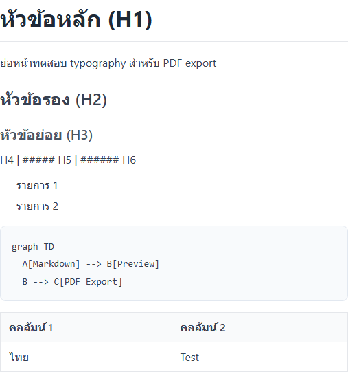
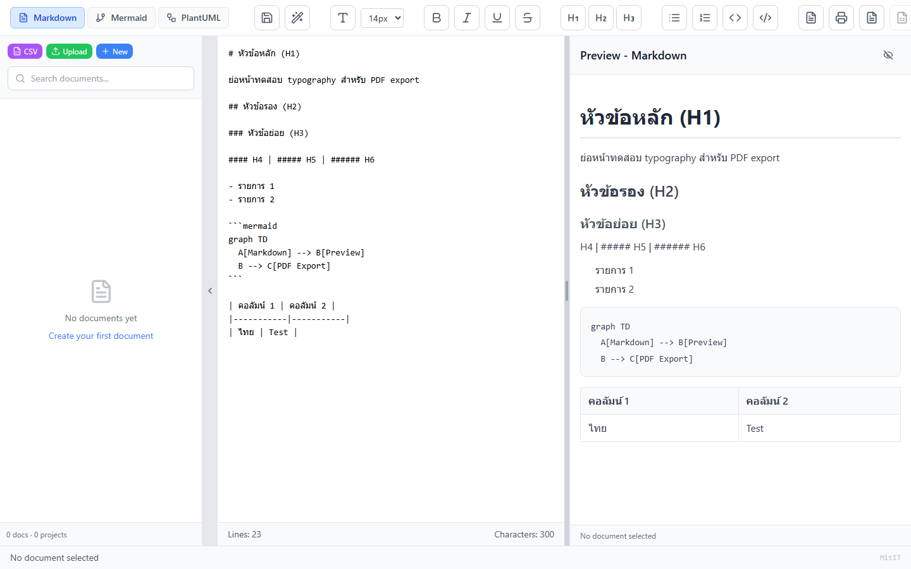
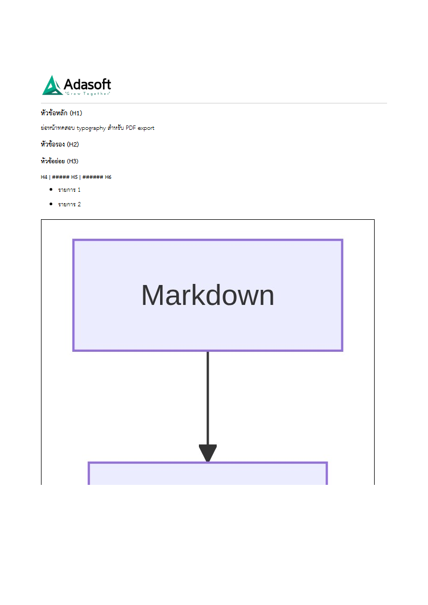
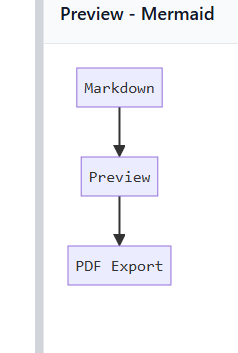

# System Test Report — PDF Export Typography & Template
Date: 2026-06-06  
Tester: AdaSoft Tester Agent  
Reviewer: SA Agent

## Test Cases
| TC | Description | Input | Expected | Result | Screenshot | Note |
|---|---|---|---|---|---|---|
| TC-01 | Preview heading typography (H1–H6) | Markdown test doc in editor | Headings render ถูก scale | ✅ PASS |  | Preview panel |
| TC-02 | Main program screen | Editor + Preview + Sidebar | UI แสดงครบ | ✅ PASS |  | Full app |
| TC-03 | PDF export preview + Adasoft header | In-app PDF render overlay | Logo + address + body | ✅ PASS |  | Browser export path |
| TC-04 | Mermaid diagram preview | Mermaid mode flowchart | Diagram แสดงใน Preview | ✅ PASS |  | Mermaid tab |
| TC-05 | Export toolbar | Markdown mode toolbar | ปุ่ม Export PDF / DOCX ปรากฏ | ✅ PASS |  | Top toolbar |

## Coverage Summary
- UI Test: 5 scenarios, 5 pass, 0 fail
- Script Test (verify-*.mjs): 4 pass (automated, no UI screenshot)
- Word COM PDF: skipped (requires Word on host)

## Bugs Found
| BUG | Severity | Description | Screenshot | Status |
|---|---|---|---|---|
| — | — | No bugs found | — | — |

## Screenshots Index
> Path: `docs/test/screenshots/250606-pdf-export-typography/`  
> Capture script: `scripts/capture-ui-screenshots.mjs` (Playwright + Vite dev server)

| File | TC | Result |
|---|---|---|
| TC-01-pass-heading-preview.png | TC-01 | ✅ PASS |
| TC-02-pass-app-main-screen.png | TC-02 | ✅ PASS |
| TC-03-pass-pdf-export-header.png | TC-03 | ✅ PASS |
| TC-04-pass-mermaid-diagram.png | TC-04 | ✅ PASS |
| TC-05-pass-export-toolbar.png | TC-05 | ✅ PASS |
