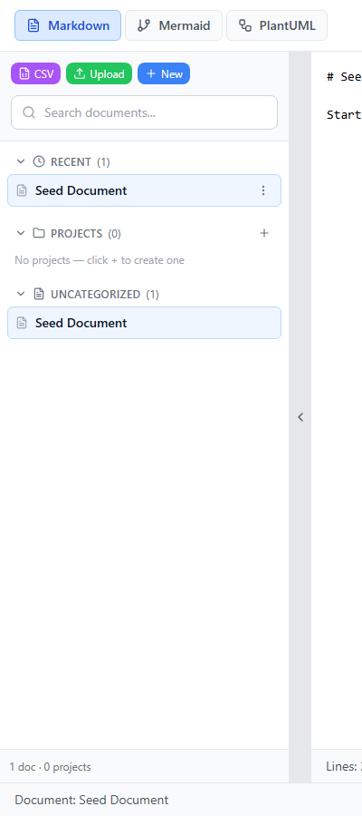
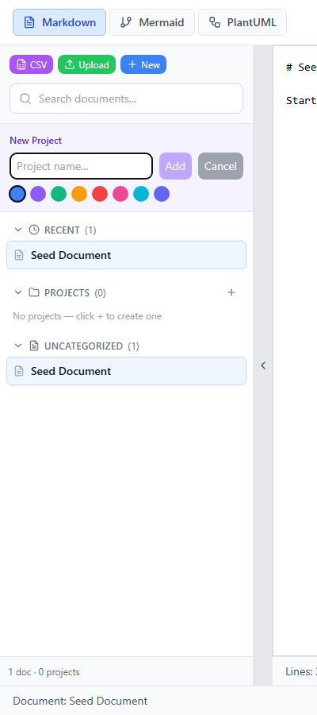
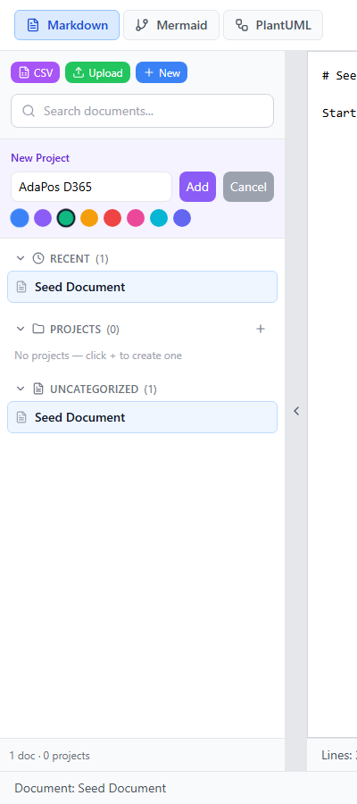
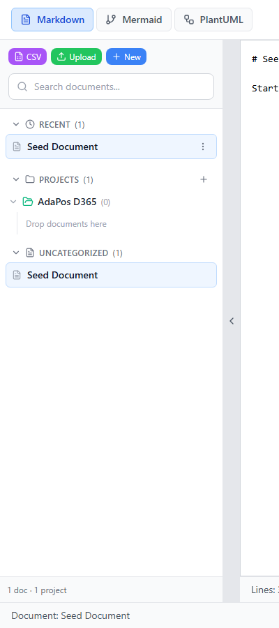
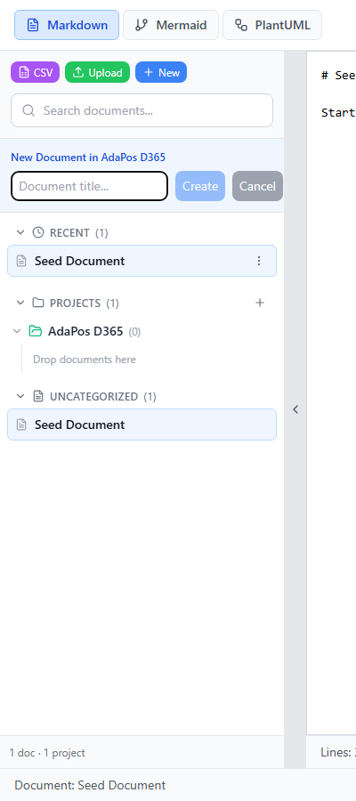
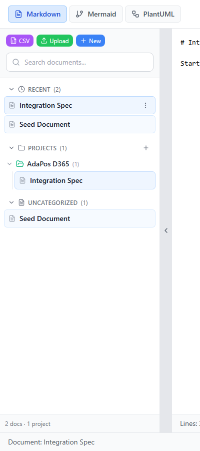
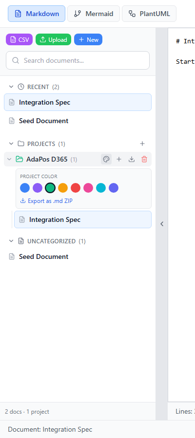
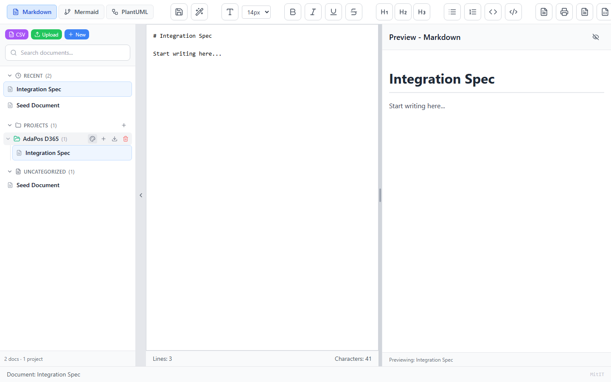

# Test Report — Project Grouping (Add Project)
Date: 2026-06-06   Version: 1.0.0  
Status: ✅ PASS

## Executive Summary
ทดสอบ UI การเพิ่ม Project สำหรับ grouping ไฟล์ใน MitIT Markdown Editor ผ่าน Playwright — ครอบคลุมฟอร์ม New Project, เลือกสี, สร้าง project, เพิ่มเอกสารใน project และ color picker ผ่าน 8/8 test cases

## Test Evidence — Screenshots (Program UI)

### ✅ Passed Tests
| TC | Description | Screenshot |
|---|---|---|
| TC-01 | Projects section (sidebar) |  |
| TC-02 | New Project form |  |
| TC-03 | กรอกชื่อ + เลือกสี |  |
| TC-04 | Project สร้างสำเร็จ |  |
| TC-05 | New Document in project |  |
| TC-06 | เอกสาร grouped ใต้ project |  |
| TC-07 | Project color picker |  |
| TC-08 | หน้าจอโปรแกรมเต็ม |  |

> 📁 All screenshots: `docs/test/screenshots/250606-project-grouping/`  
> 🔁 Regenerate: `node scripts/capture-project-ui-screenshots.mjs`

## Acceptance Criteria Mapping
| AC | Criterion | Result |
|---|---|---|
| AC-01 | สร้าง project ได้จาก sidebar | ✅ TC-04 |
| AC-02 | สร้าง doc ใน project ได้ | ✅ TC-05, TC-06 |
| AC-08 | Regression — editor ยังใช้งานได้ | ✅ TC-08 |

## Sign-off
| Role | Status |
|------|--------|
| Tester | ✅ PASS — 2026-06-06 |
| BA | ✅ User journey ครบ (create project → add doc) |
| PM | ✅ Ready (UI scope) |
