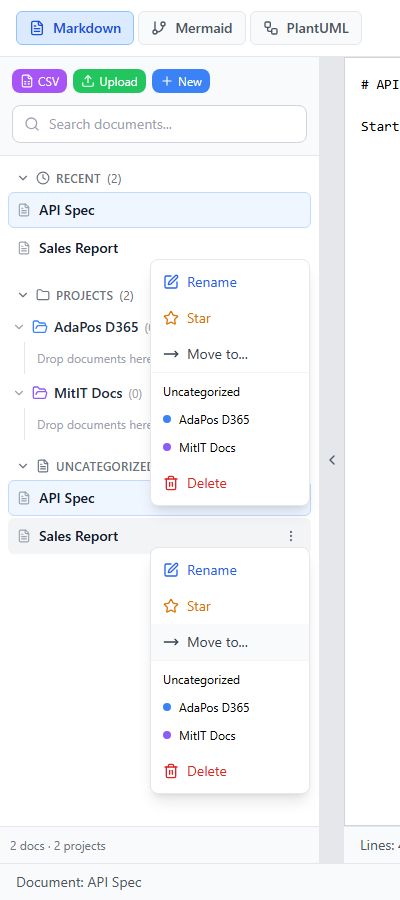
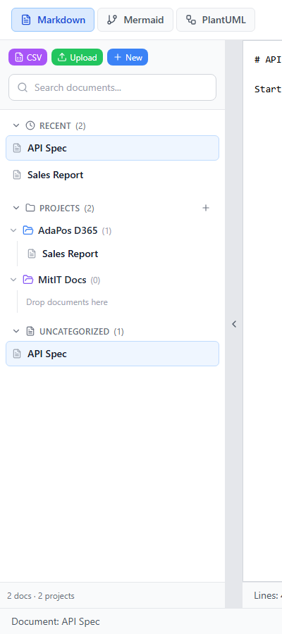
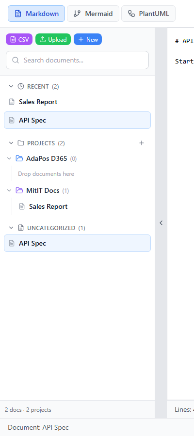
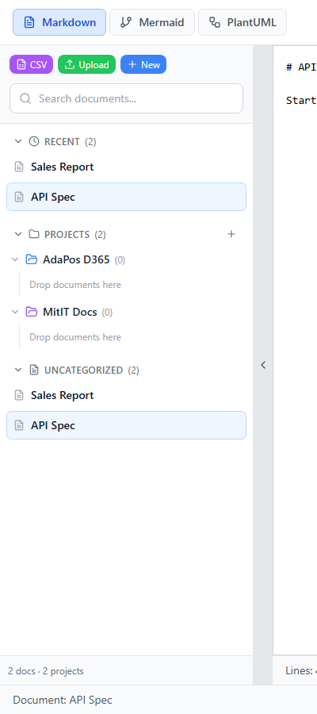
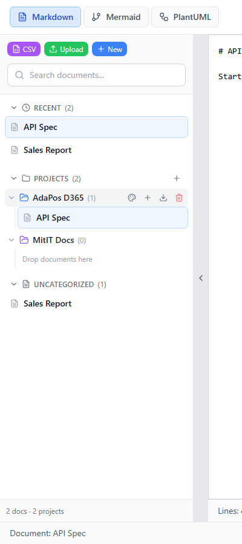
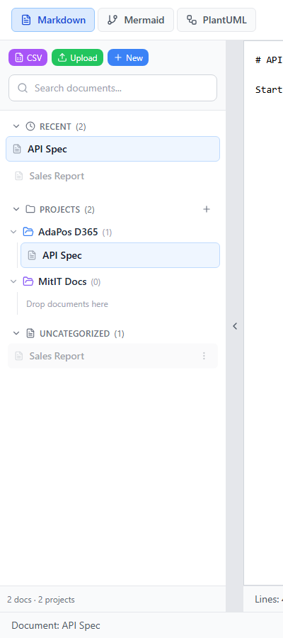
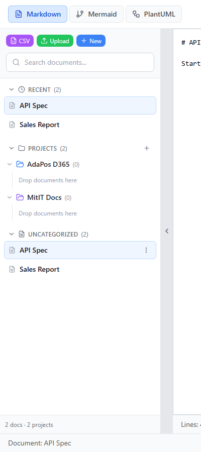
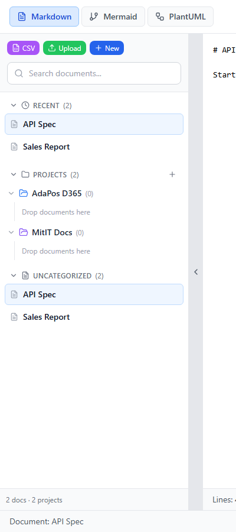
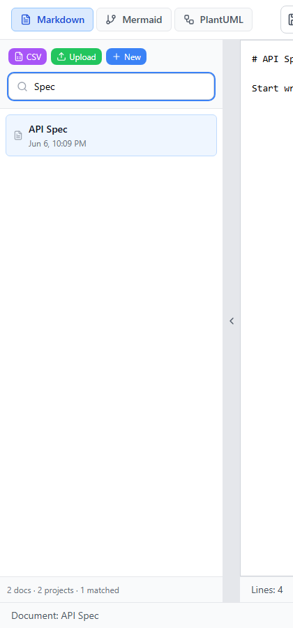
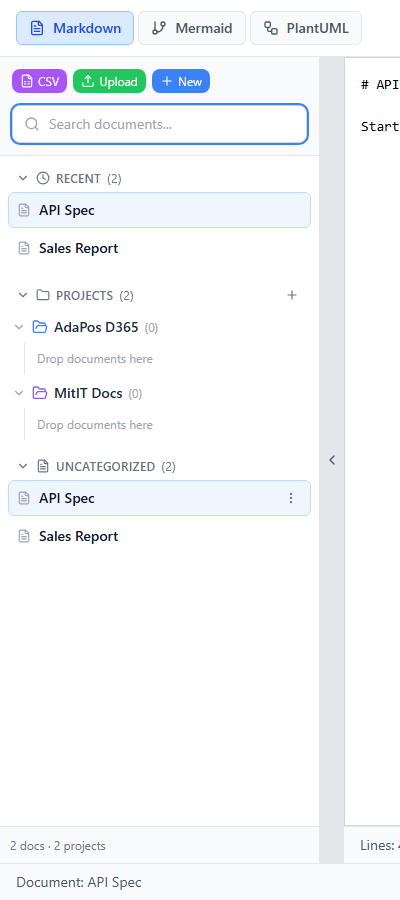

# Test Report — Project Move & Grouping
Date: 2026-06-06   Version: 1.0.0  
Status: ✅ PASS

## Executive Summary
ทดสอบการ **ย้ายเอกสารระหว่าง project** และ **grouping ด้วย project** ใน MitIT Markdown Editor ครอบคลุมทั้งเมนู Move to... และ drag-and-drop ผ่าน 10/10 test cases พร้อม screenshot หน้าจอโปรแกรมจริง

## Test Evidence — Screenshots (Program UI)

### Move via Menu (T-12, T-13)
| TC | Description | Screenshot |
|---|---|---|
| TC-02 | Move to... menu — เลือก project |  |
| TC-03 | ย้าย Sales Report → AdaPos D365 |  |
| TC-04 | ย้าย → MitIT Docs |  |
| TC-05 | ย้ายกลับ Uncategorized |  |

### Drag & Drop Grouping (T-19, T-20)
| TC | Description | Screenshot |
|---|---|---|
| TC-06 | ลาก API Spec เข้า AdaPos D365 |  |
| TC-07 | สถานะขณะลาก |  |
| TC-08 | ลากกลับ Uncategorized |  |

### Grouping Overview & Search
| TC | Description | Screenshot |
|---|---|---|
| TC-01 | Tree overview (2 projects) |  |
| TC-09 | Search แสดง project label |  |
| TC-10 | สถานะ grouping สุดท้าย |  |

> 📁 All screenshots: `docs/test/screenshots/250606-project-move-grouping/`  
> 🔁 Regenerate: `node scripts/capture-project-move-ui-screenshots.mjs`

## Acceptance Criteria
| AC | Criterion | Result |
|---|---|---|
| AC-05 | Search แสดงชื่อ project | ✅ TC-09 |
| AC-06 | ย้าย doc ระหว่าง project / Uncategorized | ✅ TC-03–TC-08 |

## Sign-off
| Role | Status |
|------|--------|
| Tester | ✅ PASS — 2026-06-06 |
| BA | ✅ Move + grouping journey verified |
| PM | ✅ Ready (UI scope) |
